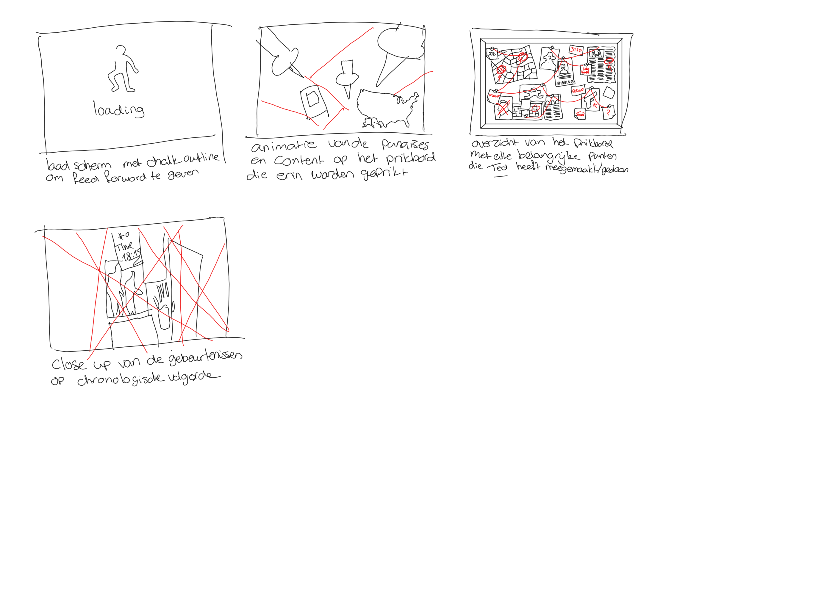

## Jij

### Ontwerper:
Luna Hali

#### Je startniveau:
Mijn startniveau is: blauw

# Je plan

  
De eerste versie/schets van je ontwerp & je persoonlijke uitdaging

  ### De eerste versie/schets:
  

  ### Je ambitie: 
  Aan deze technieken/punten wil ik werken:
  - Het begrijpen van codetaal die online staat, die ik wil gebruiken
  - Meer leren van javascript
  - Mijn niveau naar een hoger level brengen
 

## Voortgang/Feedback 1

  
Mijn bevindingen + wijzigingen (minimaal 5)

  ### Bevinding 1:
  Isabelle was enthousiast over het idee en vond het ook een orgineel idee.

  #### oplossing:
  Ik heb hier niet echt een oplossing voor. Ik ben wel verder gegaan met het idee wat ik had, aangezien ik bevestiging heb gekregen dat het een goed concept is.

  ### Bevinding 2:
  Het enige wat Isabelle zich afvroeg of ik het allemaal voor elkaar zou krijgen. 

  #### oplossing:
  Ik ben gaan spelen met de ideeën die ik had, en ben er achter gekomen dat niet alles lukte, maar ben blij met wat ik voor elkaar hebb gekregen.

## Voortgang/Feedback 2

  
Mijn bevindingen + wijzigingen (minimaal 5)

  
  ### Bevinding 1:
  Nadia heeft mij erop gewezen dat ik sommige divs kon vervangen voor sections. 

  #### oplossing:
  Ik heb de divjes die ik kon vervangen veranders naar sections.

  ### Bevinding 2:
  Nadia heeft mij erop gewezen dat het handiger is om buttons te gebruiken ipv a en img. 

  #### oplossing:
  Ik heb de a'tjes veranderd naar button. In de css heb ik een background img aan alle buttons gegeven. Ik heb de buttons gestyled door :nth-of-type.

  ### Bevinding 3:
  Ik liep vast met mijn carousel. Ik heb hiervoor hulp gevraagd bij Sanne.

  ### oplossing:
  Sanne heeft mij geholpen. Ik had in mijn css de element img en button aanstaan. Die sprak dus alle images en buttons aan. Dit hebben we aangepast door de images en buttons aan te passen door main > buttons en main > img.
  
  ### Bevinding 4: 
  Ik kwam erachter dat ik nog niet mijn focus en active etc. heb aangepast.
  
  ### oplossing:
  Ik heb de focus aangepast door middel van een animatie
  

## Voortgang/Feedback 3

  
Mijn bevindingen + wijzigingen (minimaal 5)

  
  ### Bevinding 1:
  Er staat in de titel geen Ted Bundy.

  #### oplossing:
  Ik heb in de titel Ted Bundy toegoevoegd.

  ### Bevinding 2:
  Ik had meerder html bestanden.

  #### oplossing:
  Ik heb de html bestanden samengevoegd.

  ### Bevinding 3:
  Sommige uitlijning van de html waren niet goed uitgelijnd. 
  
  #### Oplossing:
  Ik heb de uitlijning aangepast.

## Reflectie

  
Mijn eindresultaat & persoonlijke ontwikkeling

  ### Je uitkomst - karakteristiek screenshot(s):
  

  ### Dit ging goed/Heb ik geleerd: 
  Ik heb geleerd hoe je popups moet maken. Ik heb geprobeerd de carousel zo goed mogelijk te begrijpen. Ik ben meer te weten gekomen over codetaal.

  

  ### Dit was lastig/Is niet gelukt:
  Ik wilde eigenlijk wat meer animaties toevoegen, maar dat lukte niet zoals ik wilde.

  

## Bronnenlijst

continu bijhouden terwijl je werkt

Nb. Wees specifiek ('css-tricks' als bron is bijv. niet specifiek genoeg).

1. https://nl.wikipedia.org/wiki/Ted_Bundy (informatie over Ted)
2. https://isgeschiedenis.nl/nieuws/seriemoordenaar-ted-bundy (informatie over Ted)
3. https://codepen.io/shooft/pen/KKgXJVm (caroussel)
4. https://codepen.io/codecustard/pen/NWpZxey (interactieve map)
5. https://chat.openai.com/ (heeft mij geholpen met het maken van de popups, ik vroeg om een bron en hij verwees naar zichzelf)
6. https://fonts.google.com/specimen/Bebas+Neue (Bebas Neue font)
7. https://www.dafont.com/bloody.font (Bloody font)
8. https://cssgradient.io/swatches/ (voor de gradient tijdens de popups)

